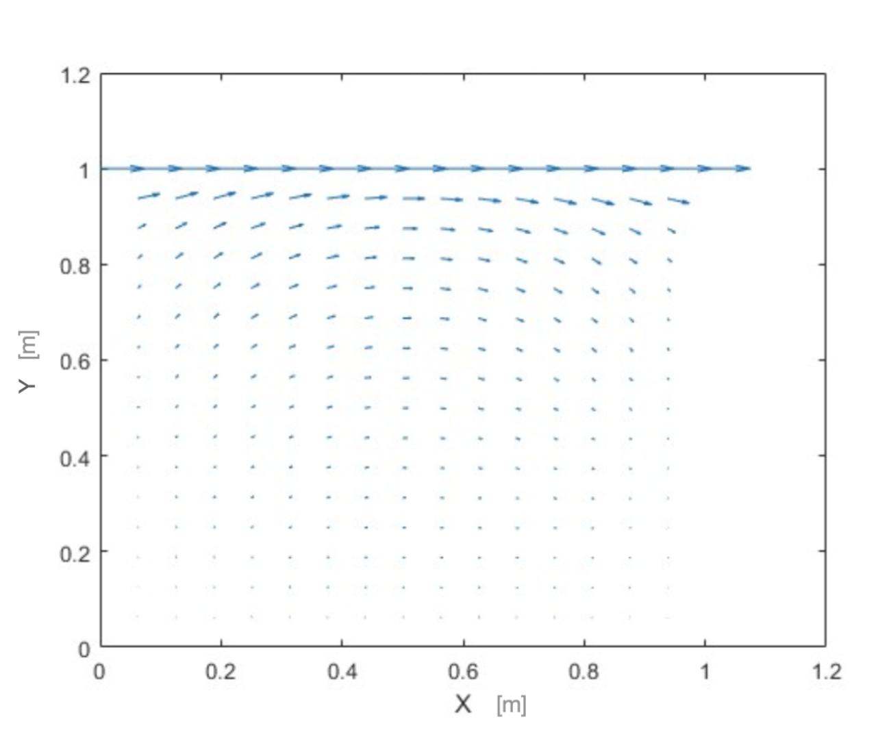
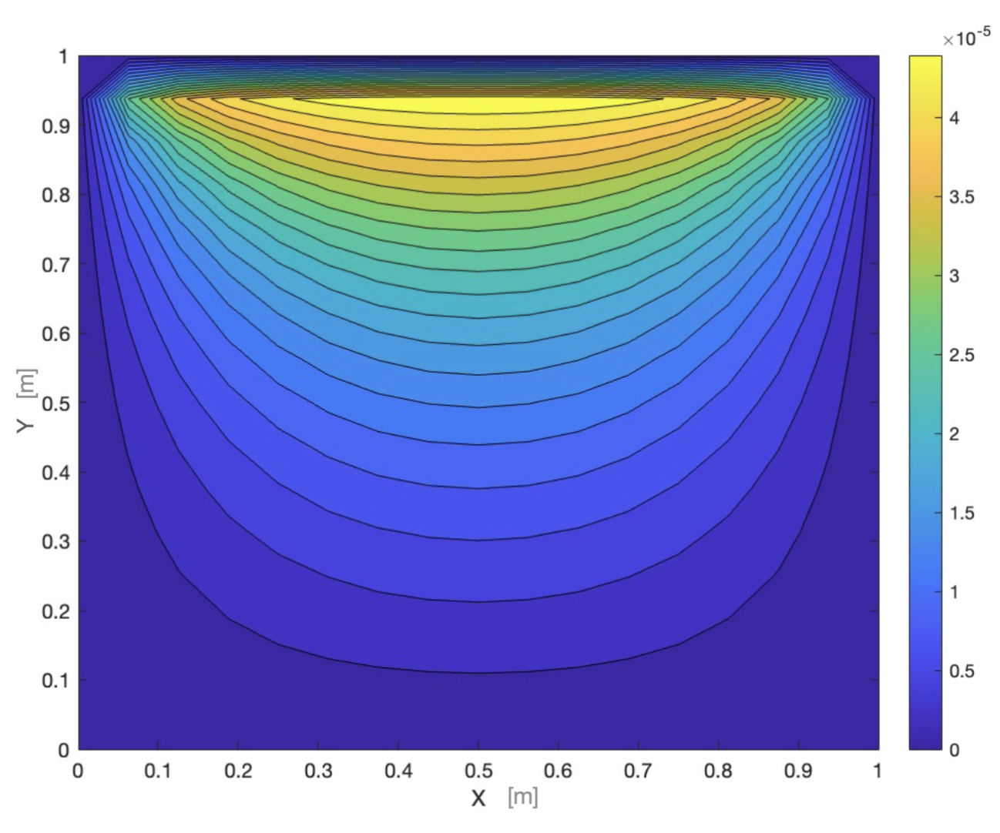
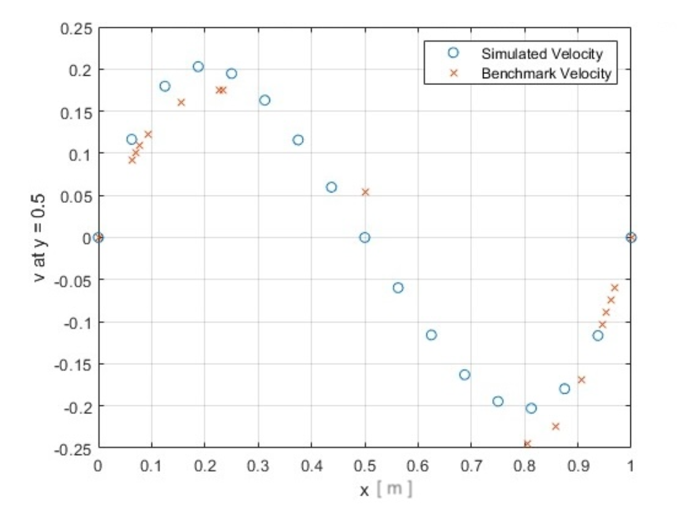
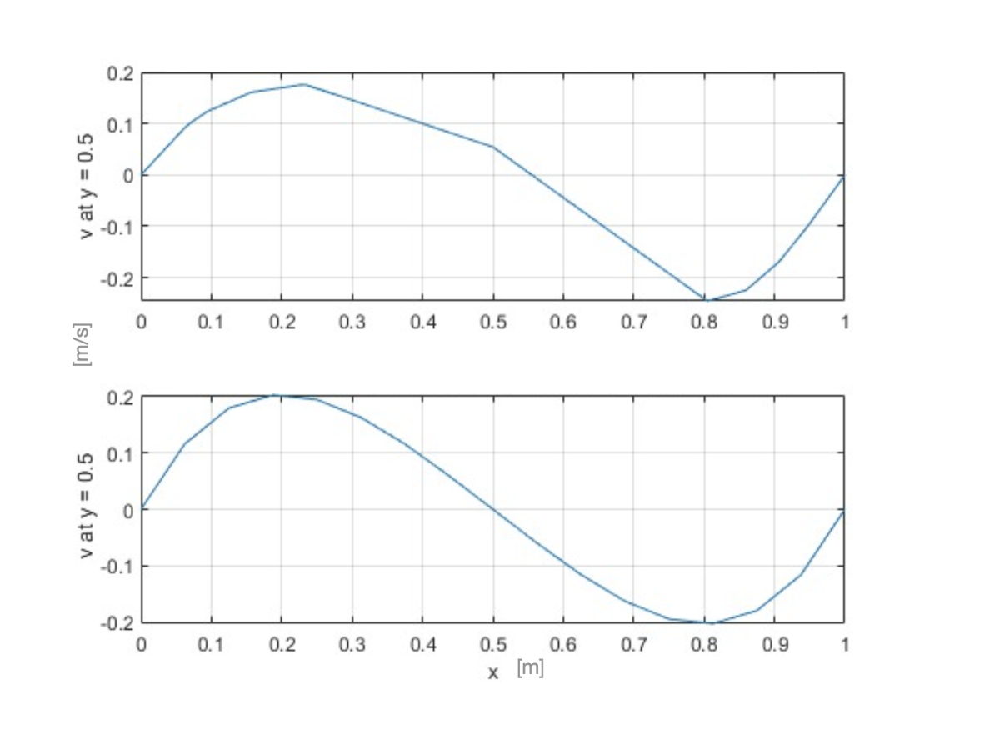

# 🌀 2D Navier-Stokes Solver

This project implements a 2D fluid dynamics solver from scratch using the Finite Difference Method (FDM) and Explicit Euler integration.  
It includes turbulence modeling via the Smagorinsky LES model, pressure smoothing using the Artificial Compressibility Method (ACM), and parameter tuning via Bayesian Optimization.

---

## 🔧 Features

- Lid-driven cavity flow simulation
- Finite Difference discretization
- Artificial Compressibility Method (ACM) for pressure-velocity coupling
- Smagorinsky LES turbulence model
- Bayesian optimization for timestep and smoothing parameter
- GPU-ready option using MATLAB's `gpuArray`

---

## 📊 Results

### 🔹 Velocity Field

### 🔹 Pressure Plot

### 🔹 Comparison to Benchmark (Pointwise)

### 🔹 Trend Comparison

---

## 🧠 Why It Matters

- Fluid simulations like this are used everywhere — from weather modeling, aerodynamics, and climate science, to visual effects and video games.

- Most people use black-box tools or libraries to run simulations. This project is about understanding how it all works underneath — actually building the solver from the ground up: the math, the code, the tuning, the validation.

- That matters because if you can build a system like this from scratch, you can understand, debug, and adapt complex systems in any technical field — whether it’s engineering, simulation, machine learning, or real-time graphics.

- Morover, adapting the solver to GLSL for browser-based simulation means the whole thing can run interactively on the web — no installations, no downloads, just physics running live in your browser. That opens doors to education, accessibility, and performance beyond traditional tools.

---

## 📘 Related Thesis

This project is based on my Bachelor's Thesis:  
📄 **“Enabling Interactive Fluid Simulations”** — Download it here (https://ltu.diva-portal.org/smash/get/diva2:1884106/FULLTEXT01.pdf)  
> (256+ downloads)

---

## 🖥️ How to Run

1. Open `src/main.m` in MATLAB
2. Adjust parameters (Reynolds number, grid size, etc.)
3. Run the script to generate quiver plots and pressure contours

---

## 📁 Project Structure

